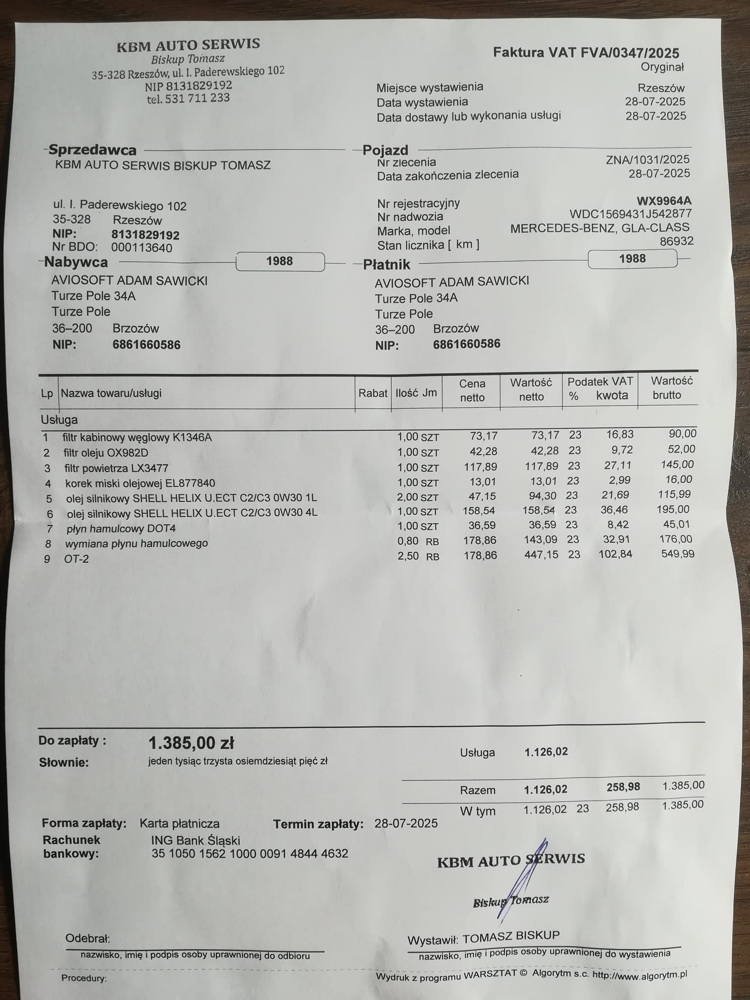

# Pixel Art Editor

A modern web application that allows you to upload images and convert them to pixel art style with real-time adjustments.



## Features

- **Image Upload**: Drag and drop or click to upload images (JPG, PNG, GIF)
- **Real-time Processing**: See changes instantly as you adjust settings
- **Pixel Size Control**: Adjust the size of pixels to create different levels of pixelation
- **Image Filters**: 
  - **Contrast**: Adjust the difference between light and dark areas
  - **Brightness**: Control the overall lightness of the image
  - **Saturation**: Modify the intensity of colors
- **Download**: Save your pixel art creations as PNG files
- **Reset**: Quickly return to default settings
- **Responsive Design**: Works on desktop and mobile devices

## How to Use

1. **Upload an Image**
   - Click on the upload area or drag and drop an image file
   - Supported formats: JPG, PNG, GIF

2. **Adjust Settings**
   - **Pixel Size**: Higher values create larger, more visible pixels
   - **Contrast**: Increase to make differences between light and dark areas more pronounced
   - **Brightness**: Adjust the overall lightness of the image
   - **Saturation**: Control how vivid the colors appear

3. **Download Your Creation**
   - Click the "Download" button to save your pixel art as a PNG file

4. **Reset Settings**
   - Use the "Reset" button to return all settings to their default values

## Technical Details

- Built with vanilla JavaScript and HTML5 Canvas
- No external dependencies required
- Uses modern browser APIs for image processing
- Responsive design with CSS Grid and Flexbox
- Real-time image filtering and pixelation

## Browser Compatibility

- Chrome 60+
- Firefox 55+
- Safari 12+
- Edge 79+

## Getting Started

1. Clone or download this repository
2. Open `index.html` in your web browser
3. Start creating pixel art!

## File Structure

```
pixel-art-editor/
├── index.html          # Main HTML file
├── styles.css          # CSS styles and responsive design
├── script.js           # JavaScript functionality
└── README.md          # This file
```

## How It Works

The application uses HTML5 Canvas for image processing:

1. **Image Loading**: Images are loaded and displayed on a canvas
2. **Filtering**: Pixel-by-pixel manipulation for brightness, contrast, and saturation
3. **Pixelation**: The image is scaled down and then back up to create the pixelated effect
4. **Real-time Updates**: All changes are applied immediately as you adjust the controls

## Customization

You can easily customize the application by:

- Modifying the CSS in `styles.css` to change the appearance
- Adjusting the filter ranges in `script.js`
- Adding new image effects by extending the `applyFilters` method
- Changing the default settings in the constructor

## License

This project is open source and available under the MIT License. # pixel-art-editor
